# Arquitectura — Tracklinker

Mapas y diagramas de la arquitectura completa del sistema **Tracklinker** (backend + frontend + base de datos + infraestructura + suite E2E). Los diagramas están escritos en [Mermaid](https://mermaid.js.org/) y se renderizan automáticamente en GitHub, GitLab, VS Code (con la extensión) y la mayoría de visores de Markdown.

> El sistema se divide en **tres repositorios**:
> - `Tracklinker-python-api/` — API REST (FastAPI + MySQL + Celery + Redis).
> - `Tracklinker-frontend-web/` — SPA (React 19 + Vite + React Query + GSAP).
> - `Traclinker_test/` — suite E2E (Serenity BDD + Cucumber + Screenplay, Java/Gradle).

---

## 1. Vista de infraestructura / despliegue

Cómo se levantan los procesos y cómo se comunican entre sí en desarrollo y producción.

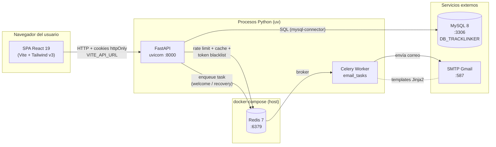

**Notas:**

- `docker-compose.yml` solo levanta **Redis** (más los servicios `api` y `celery` de la API). **MySQL es externo** — la API se conecta al host con `DB_HOST` (o `host.docker.internal` en Docker Desktop).
- CORS en FastAPI está restringido a `http://localhost:5173` (dev) y `https://tracklinker-frontend-web.vercel.app` (prod).
- Las credenciales nunca viajan en el body: el frontend usa **cookies httpOnly** (`access_token` con path `/`, `refresh_token` con path `/api/auth/refresh`).
- Variables de entorno **obligatorias** validadas por `pydantic-settings` al arranque (ver `app/core/config.py`).

---

## 2. Arquitectura del backend — capas

El backend sigue una arquitectura en capas estricta. La regla es: **routes → controller → service → repository → MySQL**. Ninguna capa se salta a la siguiente.

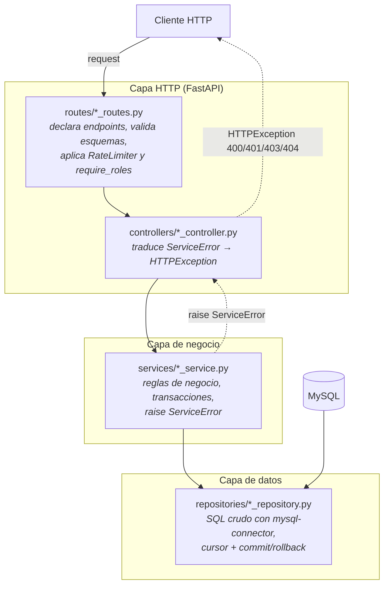

**Reglas:**

- `routes` registra endpoints, aplica `RateLimiter(times=N, seconds=60)` y `Depends(verify_jwt)` / `Depends(require_roles([...]))`.
- `controllers` son **thin**: reciben los datos ya validados, llaman al servicio y mapean `ServiceError.message` a un código HTTP.
- `services` no conocen FastAPI; lanzan `ServiceError(message)`. Aquí viven las reglas ("¿el producto está vendido?", "¿el serial ya tiene garantía activa?", etc.).
- `repositories` ejecutan SQL parametrizado y devuelven tuplas `(error, data)`. No hay ORM.
- `models/schemas/*_schemas.py` define los **inputs** (request bodies) y `models/responses/*_responses.py` los **outputs**. Modelos internos sin sufijo viven en `models/entities/`.

**Manejo de errores uniforme** (regla #3 de `AGENTS.md`):
- Repos → devuelven tuplas `(error: str | None, data)`.
- Services → convierten errores de repository en `ServiceError` y devuelven `(error, success, message)`.
- Controllers → convierten `ServiceError` en `HTTPException`.

---

## 3. Mapa de features del backend

Once features, todas con la misma estructura interna. Tres de ellas son **"thin features"** (sin todas las capas) y se apoyan en otras features.

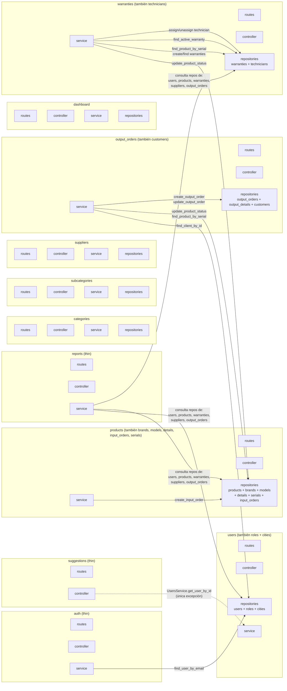

**Reglas de dependencia entre features** (de `AGENTS.md`):

- **Los services NUNCA llaman a otros services.** Si necesitan datos de otro feature, **importan directamente su repository** y comparten la misma `connection` para la transacción (un solo `commit`).
- **Los controllers sí pueden llamar a services de otros features** (excepción documentada). Ejemplo: `SuggestionsController` usa `UsersService.get_user_by_id` para obtener el email del remitente antes de enviar el correo.
- **Routes nunca llaman a repositories directamente.**

**Features "thin"** (no todas las capas):

| Feature | Capa ausente | Por qué |
|---|---|---|
| `auth` | sin repository propio | consume `UsersRepository.find_user_by_email` |
| `reports` | sin `models/` propios | consume repos de otros features y los proyecta con SQL directo (muchas vistas SQL) |
| `suggestions` | sin repository, sin service | el controller envía el correo con `FastMail` directamente usando `suggestion_mail.html` |

---

## 4. Modelo de datos (ER)

Las 17 tablas de `database/01_database.sql` y sus relaciones.

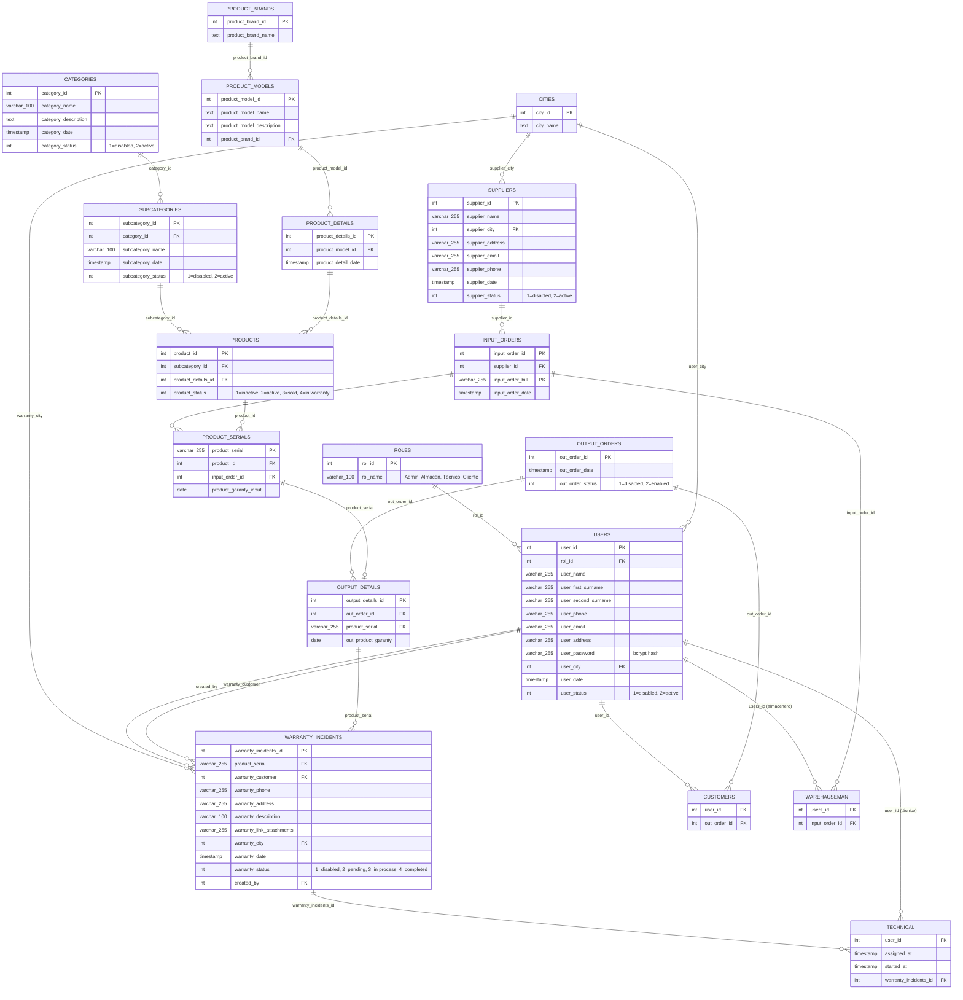

**Vistas SQL** (`database/03_views.sql`) — alimentan al módulo de reportes y dashboard:

- `get_all_users` — usuarios con el nombre de su rol.
- `get_all_products` — join completo de productos + seriales + marcas + modelos + categorías + subcategorías + proveedores.
- `get_all_subcategories` — subcategorías con su categoría.
- `get_warranties_status` — conteo agrupado por estado de garantía.
- `get_monthly_outputs` / `get_monthly_warranties` — agregados por mes/año.
- `get_supplier_inputs` — entradas agrupadas por proveedor.
- `get_output_products` — join de detalles de salida con modelo y marca.

**Códigos de estado relevantes:**

- `USERS.user_status`: `1` = deshabilitado, `2` = activo.
- `PRODUCTS.product_status`: `1` = inactivo, `2` = activo, `3` = vendido, `4` = en garantía.
- `OUTPUT_ORDERS.out_order_status`: `1` = deshabilitada, `2` = habilitada.
- `WARRANTY_INCIDENTS.warranty_status`: `1` = deshabilitada, `2` = sin empezar/pendiente, `3` = en proceso, `4` = completada.
- `CATEGORIES.category_status` / `SUBCATEGORIES.subcategory_status` / `SUPPLIERS.supplier_status`: `1` = deshabilitado, `2` = activo.

---

## 5. Árbol del frontend (SPA)

```mermaid
flowchart TD
    Main["main.jsx<br/>QueryClientProvider"] --> App["App.jsx<br/>BrowserRouter + useTheme"]
    App --> Router["AppRouter.jsx<br/>Routes"]

    Router --> Login["/login<br/>(público)"]
    Router --> Protected["rutas protegidas<br/>(ProtectedRoutes)"]

    subgraph ProtectedRoutes["ProtectedRoutes.jsx<br/>useCurrentUser + hasRole"]
        direction TB
        Protected --> Home["/home · Admin, Almacén, Técnico"]
        Protected --> Dashboard["/dashboard · Admin"]
        Protected --> Users["/users · Admin"]
        Protected --> Products["/products · Admin, Almacén, Técnico"]
        Protected --> Categories["/categories · Admin, Almacén, Técnico"]
        Protected --> Subcategories["/subcategories · Admin, Almacén, Técnico"]
        Protected --> Reports["/reports · Admin, Almacén, Técnico"]
        Protected --> Warranties["/warranties · Admin, Técnico"]
        Protected --> Suppliers["/suppliers · Admin, Almacén"]
        Protected --> OutputOrders["/output-orders · Admin, Almacén, Técnico"]
    end

    Login --> LoginPage["LoginPage<br/>LoginForm + FormButtons<br/>ErrorModal + EmailSentModal<br/>RecoverPasswordModal"]

    Home --> HomePage["HomePage<br/>SectionsContainer + ActionCards"]
    Dashboard --> DashboardPage["DashboardPage<br/>KPIs (Products, Users, Categories, Outputs)<br/>+ Charts (Recharts: Monthly, Brands, Subcategories, Warranties)"]
    Users --> UsersPage["UsersPage<br/>TopSection + UsersKpis + UsersTable<br/>+ 4 modales (Add/Edit/Enable/Disable/Filter)"]
    Products --> ProductsPage["ProductsPage<br/>TopSection + ProductsKpis + ProductsTable<br/>+ 8 modales (CRUD productos, marcas,<br/>modelos, input orders, status)"]
    Categories --> CategoriesPage["CategoriesPage<br/>CategoriesList + CategoryItem<br/>+ 5 modales (Add/Edit/MoreInfo/Enable/Disable/Filter)"]
    Subcategories --> SubcategoriesPage["SubcategoriesPage<br/>SubcategoriesList + SubcategoriesItem<br/>+ 5 modales (Add/Edit/More/Enable/Disable/Filter)"]
    Reports --> ReportsPage["ReportsPage<br/>Filtros (rango fechas) + ExportButton<br/>+ ReportCards (PDF/Excel con jsPDF)"]
    Warranties --> WarrantiesPage["WarrantiesPage<br/>WarrantiesKpis + WarrantiesTable<br/>+ 4 modales (Add/Edit/EditStatus/Filter)"]
    Suppliers --> SuppliersPage["SuppliersPage<br/>SuppliersKpis + SuppliersTable<br/>+ 5 modales (Add/Edit/MoreInfo/Enable/Disable/Filter)"]
    OutputOrders --> OutputOrdersPage["OutputOrdersPage<br/>OutputOrdersKpis + OutputOrdersTable<br/>+ 5 modales (Add/Edit/Enable/Disable/Filter)"]

    subgraph Globals["src/globals (compartido entre ≥2 módulos)"]
        G1["hooks: useModal, useInnerModal, useFlipModal,<br/>useFormValidation, useTheme, useCurrentUser,<br/>useLogout, useSearch, useAvatar, useCalendar,<br/>useCities, useSelectMenu, useInfiniteScroll,<br/>useTagInput, useActiveClients, ..."]
        G2["services: getCurrentUser, logout,<br/>getCities, sendSuggestion,<br/>updateCurrentUserInfo, ..."]
        G3["components/ui: Icon, Loader, Skeleton,<br/>FormField, DateField, DateInput, Calendar,<br/>CreateButton, FilterButton, ActionButtons,<br/>SearchBar, TopSection, Toast, Kpi, Avatar, TagInput"]
        G4["components/modals: Modal (GSAP Flip),<br/>ErrorModal, SuccessModal, FilterModal,<br/>HelpModal, ConfirmCancelButtons, SelectMenu,<br/>AddInnerModal, CreateClientModal, ProfileModal<br/>(+ EditInfo + ChangePassword + Appearance)"]
        G5["components/Layout: Layout + Aside<br/>(MobileNav, DesktopNav, NavItem, AvatarButton)"]
    end

    HomePage -. usa .-> G5
    HomePage -. usa .-> G3
    DashboardPage -. usa .-> G3
    UsersPage -. usa .-> G3
    UsersPage -. usa .-> G4
    ProductsPage -. usa .-> G3
    ProductsPage -. usa .-> G4
    CategoriesPage -. usa .-> G4
    SubcategoriesPage -. usa .-> G4
    ReportsPage -. usa .-> G3
    WarrantiesPage -. usa .-> G3
    WarrantiesPage -. usa .-> G4
    SuppliersPage -. usa .-> G3
    SuppliersPage -. usa .-> G4
    OutputOrdersPage -. usa .-> G3
    OutputOrdersPage -. usa .-> G4
    ProtectedRoutes -. usa .-> G1
    Login --> G2

    subgraph ApiConfig["src/config + src/utils"]
        AR["apiRoutes.js<br/>(mapa de endpoints)"]
        FW["fetchWithAuth.js<br/>(401 → /auth/refresh → retry una vez)"]
        U1["buildQueryParams · getDateRange<br/>formatLabel · getModalTrigger · months · colors"]
    end

    G2 --> AR
    Login --> FW
    Modules["services/* de cada módulo"] --> FW
    FW --> AR
```

**Stack:** React 19 + Vite 7 + Tailwind v3 + React Router v7 + TanStack Query 5 + GSAP 3 (Flip para animar modales) + Recharts 3 (gráficos) + jsPDF + xlsx (reportes).

**Estado global:** solo `QueryClient` (sin Redux/Zustand/Context). El usuario actual vive en la query `["currentUser"]` y se invalida al hacer login/logout/editar perfil.

**Patrón de los módulos** — todos tienen la misma forma (`Page.jsx + components/ + hooks/ + services/ + constants/`). Ver `src/modules/products/`, `src/modules/warranties/`, `src/modules/output-orders/`, etc.

**Sistema de modales — pieza más distintiva del frontend:** cada `<Modal>` se abre animando desde el `boundingRect` del elemento que lo disparó (morphing con GSAP Flip) y se cierra volviendo al mismo punto. `location` y `growDirection` parametrizan la posición final. Las modales anidadas usan `useInnerModal` + `<AddInnerModal>`.

---

## 6. Mapa completo de endpoints REST

Todos los recursos. La base es `http://localhost:8000/api`.

```mermaid
flowchart LR
    subgraph Auth["/api/auth"]
        A1["POST /login<br/>3/min"]
        A2["POST /refresh<br/>30/min"]
        A3["POST /logout<br/>50/min · JWT"]
        A4["POST /recover-password<br/>3/min"]
    end

    subgraph Users["/api/users"]
        U1["GET / · Admin<br/>30/min"]
        U2["GET /me · JWT<br/>30/min"]
        U3["GET /roles · Admin<br/>50/min"]
        U4["GET /cities · Admin<br/>50/min"]
        U5["GET /by-stats · Admin<br/>30/min"]
        U6["GET /{id} · Admin"]
        U7["POST /create · Admin"]
        U8["POST /create-client · Admin"]
        U9["PUT /update/me · JWT"]
        U10["PUT /update/me/password · JWT<br/>10/min"]
        U11["PUT /update/{id} · Admin"]
        U12["PUT /disable/{id} · Admin"]
        U13["PUT /enable/{id} · Admin"]
    end

    subgraph Products["/api/products"]
        P1["GET / · Admin, Almacén, Técnico"]
        P2["GET /brands · +caché 300s"]
        P3["GET /models · +caché 300s"]
        P4["GET /input-orders · +caché 150s"]
        P5["GET /status · +caché 300s"]
        P6["POST /create · Admin, Almacén"]
        P7["POST /create-model · Admin, Almacén"]
        P8["POST /create-brand · Admin, Almacén"]
        P9["POST /create-input-order · Admin, Almacén"]
        P10["PUT /update · Admin, Almacén"]
        P11["PUT /update-status · Admin, Almacén"]
    end

    subgraph Categories["/api/categories"]
        C1["GET / · Admin, Almacén, Técnico"]
        C2["GET /active · Admin, Almacén, Técnico"]
        C3["GET /by-stats · Admin, Almacén, Técnico"]
        C4["POST /create · Admin, Almacén"]
        C5["PUT /update · Admin, Almacén"]
        C6["PUT /disable · Admin, Almacén"]
        C7["PUT /enable · Admin, Almacén"]
    end

    subgraph Subcategories["/api/subcategories"]
        S1["GET / · Admin, Almacén, Técnico"]
        S2["GET /active · Admin, Almacén, Técnico"]
        S3["GET /by-stats · Admin, Almacén, Técnico"]
        S4["POST /create · Admin, Almacén"]
        S5["PUT /update · Admin, Almacén"]
        S6["PUT /disable · Admin, Almacén"]
        S7["PUT /enable · Admin, Almacén"]
    end

    subgraph Suppliers["/api/suppliers"]
        SP1["GET / · Admin, Almacén"]
        SP2["GET /active · Admin, Almacén"]
        SP3["POST /create · Admin, Almacén"]
        SP4["PUT /update · Admin, Almacén"]
        SP5["PUT /disable · Admin, Almacén"]
        SP6["PUT /enable · Admin, Almacén"]
    end

    subgraph OutputOrders["/api/output_orders"]
        OO1["GET / · Admin"]
        OO2["GET /{id} · Admin"]
        OO3["POST /create · Admin"]
        OO4["PUT /update · Admin"]
        OO5["PUT /disable · Admin"]
        OO6["PUT /enable · Admin"]
    end

    subgraph Warranties["/api/warranty_incidents"]
        W1["GET / · Admin, Técnico"]
        W2["GET /{id} · Admin, Técnico"]
        W3["POST /create · Admin, Técnico · JWT"]
        W4["PUT /update/{id} · Admin, Técnico · JWT"]
    end

    subgraph Dashboard["/api/dashboard"]
        D1["GET /products-amount · Admin"]
        D2["GET /users-amount · Admin"]
        D3["GET /categories-amount · Admin"]
        D4["GET /output-orders-amount · Admin"]
        D5["GET /warranties-amount · Admin"]
        D6["GET /suppliers-amount · Admin"]
        D7["GET /subcategories-amount · Admin"]
        D8["GET /monthly-outputs · Admin"]
        D9["GET /monthly-warranties · Admin"]
    end

    subgraph Reports["/api/reports"]
        R1["GET /get_users_by_rol/{period} · Admin"]
        R2["GET /get_recent_users · Admin"]
        R3["GET /get_user_growth/{period} · Admin"]
        R4["GET /get_users_by_status · Admin"]
        R5["GET /get_recent_products · Admin"]
        R6["GET /get_products_growth/{period} · Admin"]
        R7["GET /get_products_by_brand/{period} · Admin"]
        R8["GET /get_products_by_status · Admin"]
        R9["GET /get_recent_categories · Admin"]
        R10["GET /get_categories_growth/{period} · Admin"]
        R11["GET /get_recent_subcategories · Admin"]
        R12["GET /get_subcategories_by_category/{period} · Admin"]
        R13["GET /get_recent_warranties · Admin"]
        R14["GET /get_warranties_growth/{period} · Admin"]
        R15["GET /get_warranties_by_brand/{period} · Admin"]
        R16["GET /get_recent_suppliers · Admin"]
        R17["GET /get_suppliers_growth/{period} · Admin"]
        R18["GET /get_recent_outputs · Admin"]
        R19["GET /get_outputs_growth/{period} · Admin"]
        R20["GET /get_outputs_by_brand/{period} · Admin"]
    end

    subgraph Suggestions["/api/suggestion"]
        SG1["POST /send · JWT"]
    end
```

**Totales:** 4 auth + 13 users + 11 products + 7 categories + 7 subcategories + 6 suppliers + 6 output_orders + 4 warranties + 9 dashboard + 20 reports + 1 suggestion = **88 endpoints de feature** + 2 de sistema (`/`, `/ping-db`).

**Rate limiting:** todos los endpoints llevan `RateLimiter(times=N, seconds=60)` con Redis como backend (vía `FastAPILimiter`). Los más agresivos: `login` y `recover-password` 3/min, `update-password` 10/min, `logout` 50/min, listados 30/min, catálogos cacheados 50/min.

**Caché:** `app/core/cache.py` envuelve Redis con helpers `get_cache`, `set_cache`, `invalidate_cache`. Se aplica a catálogos de baja volatilidad (`brands`, `models`, `status`, `input_orders`) y se invalida explícitamente tras cada mutación.

---

## 7. Flujo de autenticación

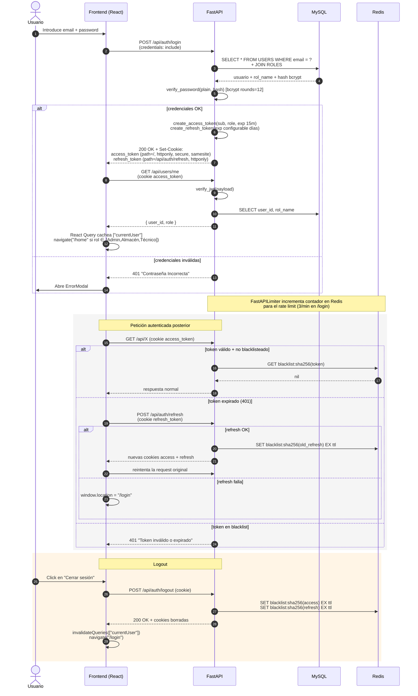

**Decisión clave:** el frontend **nunca** lee el JWT. Todo viaja en cookies httpOnly. `fetchWithAuth` envuelve cada llamada: si llega 401, llama a `/auth/refresh` una sola vez (compartiendo `refreshPromise` con llamadas concurrentes) y reintenta.

**Blacklist de tokens revocados** (`app/core/token_blacklist.py`): los JWTs se hashean con SHA-256 antes de guardarse en Redis con TTL = tiempo de vida restante del token. Garantiza que un `logout` invalida el token antes de su `exp` natural.

**Roles** (de `database/02_dml.sql`): `Admin`, `Almacén`, `Técnico`, `Cliente` (este último no se usa en la UI actual — todos los usuarios inician sesión en la misma SPA).

---

## 8. Flujo del dominio — Entrada, venta y garantía

El ciclo de vida principal del producto: **compra → venta → garantía → cierre**.

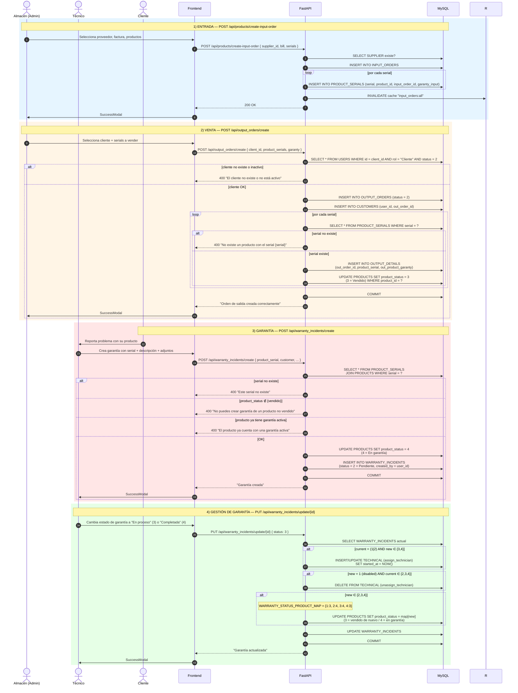

**Máquina de estados del producto** (`product_status`):

```
            ┌──────────┐   create      ┌──────────┐   sale        ┌──────────┐   warranty      ┌──────────┐
            │ 1 = Inac │ ────────────▶ │ 2 = Acti │ ────────────▶ │ 3 = Vend │ ──────────────▶ │ 4 = Gar  │
            │  tivo    │               │  vo      │               │  ido     │                 │  antía   │
            └──────────┘               └──────────┘               └──────────┘ ◀────────────── └──────────┘
                                                                                       warranty close
                                                                                       (4 → 3 vendido de nuevo)
```

**Máquina de estados de la garantía** (`warranty_status`):

```
1 (Deshabilitada) ⇄ 2 (Pendiente) → 3 (En proceso) → 4 (Completada)
       ↕                              ↕
   (reapertura)                  (asigna técnico)
```

**Transacciones que cruzan features** (comparten `connection`, un solo `commit`):

- `OutputOrdersService.create_output_order` toca `UsersRepository` (validar cliente) + `OutputOrdersRepository` (crear orden) + `CustomersRepository` (relación cliente-orden) + `ProductSerialsRepository` (validar serials) + `OutputDetailsRepository` (detalles) + `ProductsRepository` (cambiar status a vendido).
- `WarrantiesService.create_warranty` toca `ProductSerialsRepository` (validar serial) + `WarrantiesRepository` (verificar garantía activa) + `ProductsRepository` (cambiar status a en garantía).
- `WarrantiesService.update_warranty` toca hasta **4 repositorios** en una sola transacción: `WarrantiesRepository` + `TechniciansRepository` + `ProductSerialsRepository` + `ProductsRepository`.

---

## 9. Mapa de componentes globales reutilizables

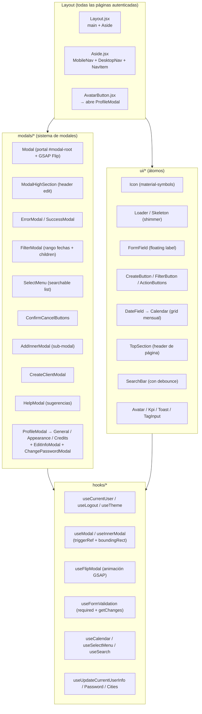

**Sistema de modales — pieza más distintiva del frontend:** cada `<Modal>` se abre animando desde el `boundingRect` del elemento que lo disparó (morphing con GSAP Flip) y se cierra volviendo al mismo punto. `location` y `growDirection` parametrizan la posición final (centro, esquinas, anclado al disparador). Las modales anidadas usan `useInnerModal` + `<AddInnerModal>`.

**Regla del repo:** `src/globals/` contiene **únicamente** lo que se reutiliza entre ≥2 módulos. Si solo lo usa un módulo, pertenece a `src/modules/<modulo>/`.

---

## 10. Suite E2E — `Traclinker_test/`

Tercer repositorio: pruebas automatizadas de extremo a extremo con **Serenity BDD + Cucumber + Screenplay Pattern** sobre la SPA.

```mermaid
flowchart LR
    subgraph Features["src/test/resources/features (10 Gherkin en español)"]
        F1["login.feature"]
        F2["crearCategoria.feature"]
        F3["crearSubcategoria.feature"]
        F4["crearProducto.feature"]
        F5["crearGarantia.feature"]
        F6["crearusuario.feature"]
        F7["editarCategoria.feature"]
        F8["editarProducto.feature"]
        F9["editarGarantia.feature"]
        F10["editarusuario.feature"]
    end

    subgraph Runners["src/test/java/.../runners (10)"]
        R1["login.java"]
        R2["crearCategoria.java"]
        R3["crearSubcategoria.java"]
        R4["crearProducto.java"]
        R5["crearGarantia.java"]
        R6["crearUsuario.java"]
        R7["editarCategoria.java"]
        R8["editarProducto.java"]
        R9["editarGarantia.java"]
        R10["editarUsuario.java"]
    end

    subgraph Steps["src/test/java/.../stepsdefinitions (10)"]
        S1["LoginStepsDefinitions"]
        S2["crearCategoriaStepsDefinitions"]
        S3["crearSubcategoriaStepsDefinitions"]
        S4["crearProductoStepsDefinitions"]
        S5["crearGarantiaStepsDefinitions"]
        S6["crearUsuarioStepsDefinitions"]
        S7["editarCategoriaStepsDefinitions"]
        S8["editarProductoStepDefinitions"]
        S9["editarGarantiaStepsDefinitions"]
        S10["editarUsuarioStepsDefinitions"]
    end

    subgraph Screenplay["Patrón Screenplay (orquestación)"]
        T1["Tasks: AbrirPagina, Autenticarse, ..."]
        Q1["Questions: ValidacionLogin, ..."]
        M1["Models: CredencialesInicioSesion, ..."]
    end

    subgraph Web["WebDriver (Chrome)"]
        W1["chromedriver.exe<br/>(en src/test/resources/Drivers/)"]
    end

    Features --> Runners
    Runners --> Steps
    Steps --> Screenplay
    Screenplay --> Web
    Web --> SPA["Tracklinker-frontend-web<br/>(Vite dev server)"]
```

**Stack:**

- **Serenity BDD 2.1.1** (plugin Gradle `net.serenity-bdd.aggregator`).
- **Cucumber 1.9.51** para Gherkin en español (`# language: es`).
- **Serenity Screenplay** (Core + WebDriver + REST + Ensure) para el patrón de actores.
- **Apache POI 4.1.2** para data-driven testing desde Excel.
- **WebDriver Chrome** (`chromedriver.exe` empaquetado en `src/test/resources/Drivers/`).
- **Screenshots después de cada step** (`serenity.take.screenshots=AFTER_EACH_STEP`).
- **Reportes HTML** generados en `target/cucumber-reports` + reporte agregado Serenity con screenshots.

**Ejemplo Gherkin** (`login.feature`):

```gherkin
# language: es
# author: Rigoberto Vargas

Característica: Inicio de sesión
  Como usuario registrado
  quiero iniciar sesión en la aplicación
  para poder acceder a mi cuenta

  @autenticacion
  Escenario: Verificar autenticación exitosa en Traclinker
    Dado que el usuario está en la página de inicio de sesión
    Cuando el usuario ingresa credenciales válidas
      | usuario              | clave |
      | juanesyt7@gmail.com  | 12345 |
    Entonces el usuario debería estar en la pagina de bienvenida
```

**Ejemplo de Steps con Screenplay** (`LoginStepsDefinitions.java`):

```java
@Dado("^que el usuario está en la página de inicio de sesión$")
public void queElUsuarioEstáEnLaPáginaDeInicioDeSesión() {
    theActorInTheSpotlight().wasAbleTo(AbrirPagina.laPagina());
}

@Cuando("^el usuario ingresa credenciales válidas$")
public void elUsuarioIngresaCredencialesVálidas(
        List<CredencialesInicioSesion> credenciales) {
    theActorInTheSpotlight().attemptsTo(Autenticarse.aute(credenciales));
}

@Entonces("^el usuario debería estar en la pagina de bienvenida$")
public void elUsuarioDeberíaEstarEnLaPaginaDeBienvenida() {
    theActorInTheSpotlight().should(seeThat(ValidacionLogin.validacionLogin()));
}
```

**Ejecución:**

```bash
./gradlew test                 # corre todos los runners (uno por feature)
./gradlew aggregate            # genera el reporte Serenity agregado
```

---

## 11. Resumen de una sola vista

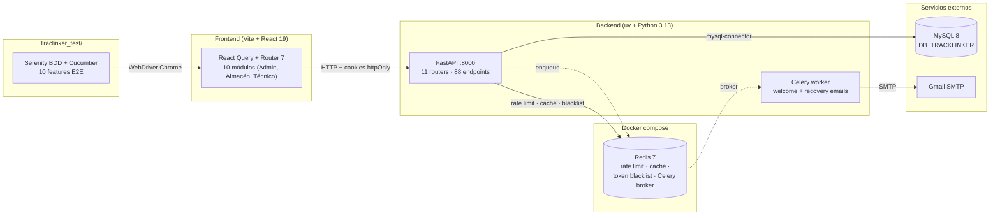

| Capa | Tecnología | Responsabilidad |
|---|---|---|
| **Cliente** | React 19, Vite 7, Tailwind v3, React Router 7, TanStack Query 5, GSAP 3, Recharts 3, jsPDF, xlsx | UI, fetch con cookies, animaciones de modales, sin estado global (solo React Query) |
| **API** | FastAPI 0.136, Pydantic 2.13, Pydantic-Settings, PyJWT, bcrypt, FastAPI-Limiter | Endpoints REST, validación, JWT cookies, rate limit, blacklist de tokens (Redis) |
| **Workers** | Celery 5.6 + Redis broker + FastMail + Jinja2 | Emails transaccionales (bienvenida, recuperación de contraseña) |
| **Persistencia** | MySQL 8 (utf8mb4) + mysql-connector-python | 17 tablas, 7 vistas SQL, índices por FK, soft-delete por campos `*_status` |
| **Cache / broker** | Redis 7 | Rate limiting + caché de catálogos + token blacklist + broker de Celery |
| **Auth** | JWT HS256 (access 15min, refresh configurable) en cookies httpOnly | `verify_jwt` carga `user_id` + `role` → RBAC por middleware `require_roles` |
| **E2E** | Serenity BDD 2.1.1 + Cucumber 1.9.51 + Screenplay (Java 8 + Gradle) | 10 features Gherkin, WebDriver Chrome, screenshots por step, data-driven con Apache POI |
